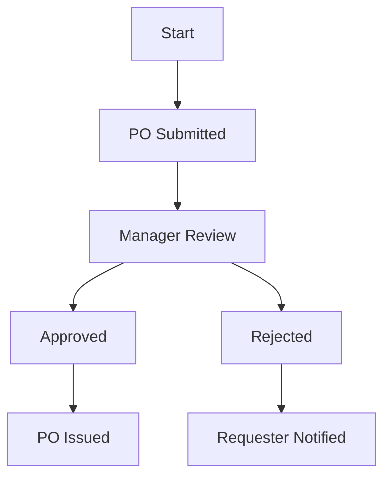

# Example Process Flow (Sanitized)

## Purpose
Illustrates AS-IS/TO-BE Mermaid diagram conventions using a generic, non-confidential scenario.

## Scope
Covers a generic 'Purchase Order Approval' example scenario only.

## Intended Usage
Use as a formatting reference for future process flow diagrams.

## Example Diagram

## Future Expansion
Will be expanded with a matching swimlane-style diagram example.
