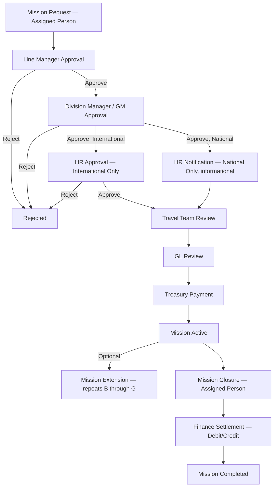

# Business Requirements Document — MTN Sudan Travel Mission Management System

## Purpose
Formal BRD for this engagement, structured per [02_Standards/BRD.md](../../../02_Standards/BRD.md). Business content only — sprint status, developer activity, and technical implementation detail are intentionally excluded per Document Boundaries and are tracked instead in [00_Governance](../00_Governance/README.md) and [03_Design](../03_Design/README.md).

## Scope
Applies to the MTN Sudan Travel Mission Management System. Content is sourced exclusively from uploaded project artifacts. Every statement is traceable; unconfirmed items are explicitly marked `MISSING INFORMATION` or `CLARIFICATION REQUIRED`.

## Intended Usage
Primary reference for Business Sponsor, Steering Committee, Product Owner, and Client (MTN Sudan) review.

---

## 1. Document Information

| Field | Value |
|---|---|
| Document Version | 1.0 (migrated) — consolidates and restructures `APPROVED_SOURCE_OF_TRUTH_MTN_Travel_v3_docx.docx` (v3.0, 22 June 2026) into the repository's standard BRD template |
| Date | Migration date: see repository commit history. Source document date: 22 June 2026 |
| Prepared By | Target Team (BA / SA / UX / QA) — per source document cover page |
| Source Documents | `APPROVED_SOURCE_OF_TRUTH_MTN_Travel_v3_docx.docx`; `Travel_System_Requirements.docx`; `Minutes_of_Meeting___MTN_Travel_Mission_Management_System.docx`; `MTN_Travel_Product_Backlog_TFS.docx`; second-session transcript materials; daily scrum MoMs; client email correspondence |
| Status | ACTIVE — REQUIRES CLARIFICATION on items marked below |

## 2. Overview
The MTN Sudan Travel Mission Management System manages employee travel missions from request creation through financial settlement and closure, covering National and International mission types. The system automates approvals, travel cost calculation, payment processing, mission closure, and financial settlement. *(Source: `Travel_System_Requirements.docx`)*

## 3. Business Objective
**MISSING INFORMATION — BUSINESS CLARIFICATION REQUIRED.** No uploaded artifact states a formal, standalone Business Objective statement (e.g. cost savings target, process-time reduction target, compliance driver). The closest available evidence is the System Overview above and the platform-preference rationale in MoM §13: *"MTN Sudan confirmed the preference to implement the solution directly on the Microsoft 365 / SharePoint environment to align with existing systems and avoid duplicate effort."* This describes a platform rationale, not a business objective, and should not be conflated with one.

## 4. Scope
In scope, per the validated workflow and confirmed backlog (`APPROVED_SOURCE_OF_TRUTH_MTN_Travel_v3_docx.docx` Section 3):
- Dashboard (KPIs, pending approvals/payments widgets)
- Mission Management (Mission List, Mission Details, My Missions)
- Mission Creation (including validation rules and business rules BR-01–BR-04)
- Approval Workflow (Line Manager, Division Manager, and — pending confirmation — HR)
- Travel Review (cost entry: Per Diem, Accommodation, Other Expenses)
- GL Review (financial validation)
- Treasury (payment processing)
- Mission Extension (with recalculation and full re-approval cycle)
- Mission Closure (including, pending clarification, Cancellation)
- Settlement (Debit/Credit)
- Reporting (Employee Mission History, Debit/Credit Report; HR Reports pending)
- Notifications (email-based)
- Security & Roles (role-based access, Microsoft 365/Azure AD provisioning)

## 5. Out of Scope
Explicitly excluded per `MTN_Travel_System_Figma_Spec.md` Phase 1 audit (items removed from the UX design as unsupported by requirements):
- "Archived" mission status (only "Rejected" exists)
- Any Finance GL integration or "HR logs employee absence" step (not a defined system step)
- Automated system-notification module beyond the confirmed email notifications
- Audit log module (beyond the specific Extension "Extended By" audit field, which IS in scope)
- Administration/configuration module (beyond destination list configurability, which is in scope but MISSING a defined owner/screen)
- KPI trend/delta indicators on the Dashboard
- Manual user add/remove screen (user provisioning is via Microsoft 365 — see Section 11 Business Rule BR-Sec-01)

## 6. Stakeholders
See [Project_Metadata.md](../Project_Metadata.md) for the full stakeholder table with role and source citations. Key roles: MTN Sudan (Client) — Eng. Muhanad Elnayeer (IS), Alaa Ghandour, El Waleed Abdelgadir Mohamed, Finance contacts (Huda Mohamed Ahmed, Abeer Homida Satti), HR contacts (Shaza Mustafa Mohamed, Elmuiz Babiker Badawi); Target Integrated Systems (Delivery) — Shehabeldin Yehia (Product Owner), Abdullah Hamad (Software Development Manager), and the delivery team listed in Project Metadata.

## 7. AS-IS Process
No system predates this project per any uploaded artifact — this is confirmed to be a **new** system, not a replacement of a described legacy system, **with one partial exception**: the second-session transcript references "internal missions currently existing" for staff in Port Sudan / Khartoum with monthly auto-renewal behavior in the prior informal process, which the new system will NOT replicate (see Business Rule BR-06 below). Beyond this reference, no AS-IS process document, legacy system description, or manual-process narrative was provided.
**MISSING INFORMATION — BUSINESS CLARIFICATION REQUIRED**: full AS-IS process (how missions are currently requested/approved/paid before this system) is not documented.

## 8. TO-BE Process
Validated end-to-end workflow, per MoM Session 1 (Decision D-01) and updated per the 11 June 2026 session (source-of-truth v3 Section 4.1):

**Status note on HR steps (D1/D2 above):** confirmed as new requirements from the 11 June 2026 session, but exact placement (before or after DM approval) is **NEEDS CLARIFICATION** per Clarification Question BQ-01 — the diagram above reflects the source-of-truth v3's best-documented placement (after DM, before Travel Review) pending formal confirmation.

## 9. Functional Requirements
See [FRD.md](FRD.md) for the itemized Functional Requirements register, and [../04_Backlog/Product_Backlog.md](../04_Backlog/Product_Backlog.md) for the Epic/Feature/User Story decomposition.

## 10. Non-Functional Requirements
**MISSING INFORMATION — BUSINESS CLARIFICATION REQUIRED.** No uploaded artifact specifies performance, availability, scalability, browser/device support, localization (Arabic/English), or accessibility requirements. The only platform-related constraint documented is the Microsoft 365/SharePoint deployment preference (Section 3/8 above), which is an architecture decision, not a non-functional requirement.

## 11. Business Rules
| ID | Rule | Source |
|---|---|---|
| BR-01 | Employee cannot have more than one open mission at a time | `Travel_System_Requirements.docx`; MoM §5 (implied); source-of-truth v3 |
| BR-02 | National Mission currency = SDG | MoM §3; source-of-truth v3 |
| BR-03 | International Mission currency = USD | MoM §3; source-of-truth v3 |
| BR-04 | Mission Category must be one of: Training, Conference, Job Mission | MoM §2; source-of-truth v3 |
| BR-05 | Treasury does not approve or reject; Treasury confirms payment only. Once confirmed, mission status = Mission Active | MoM §8; source-of-truth v3 |
| BR-06 | Long-term missions (monthly) must be closed and a new mission created; auto-extension is NOT supported — each monthly mission is independent | `Travel_System_Requirements.docx` Business Controls |
| BR-07 | All workflow notifications are via email; Dashboard displays current status for authorized users | MoM §9 |
| BR-Sec-01 | User provisioning is managed via Microsoft 365 / Azure AD; no manual user add/remove screen is required — the system automatically recognizes M365 users, and deactivating an M365 account removes system access | Second-session transcript §7:59–§8:57; MoM §13 |
| BR-Ext-01 (proposed) | Per Diem = Number of Days × Rate per Destination; Accommodation = Number of Nights × Rate per Destination | **Target-proposed, not yet confirmed by MTN Sudan** — `629_email_request_enviroment_from_muhanad_and_alignment_on_phase_1.pdf` |
| BR-Grade-01 (pending) | Accommodation rate varies by employee grade (Level 2 to Level 3H referenced) | Second-session transcript §48:55–§50:36 — **exact rates MISSING INFORMATION** |

## 12. Integrations
**MISSING INFORMATION — BUSINESS CLARIFICATION REQUIRED.** No third-party or backend financial-system integration is documented. The only "integration" confirmed is the platform dependency on Microsoft 365 / Azure AD for identity/provisioning (BR-Sec-01), which is an authentication dependency rather than a data integration.

## 13. Notifications
Confirmed email notifications (MoM §9; source-of-truth v3 EP-12):
- To Line Manager, Division Manager/GM, Travel Team, GL Team, Treasury Team at their respective workflow stage.
- To Employee, after payment is processed.
- To Employee, on rejection at any stage.
- To HR, on International mission requiring approval (pending workflow-placement confirmation).
- To HR, informational notice on National mission submission.
Dashboard additionally provides in-app status visibility for authorized users (not a "notification" per se, but documented alongside notifications in MoM §9).
**MISSING INFORMATION**: exact notification content/template for HR notifications (MoM Open Item 4) is not defined.

## 14. Reports
Confirmed report screens (`Travel_System_Requirements.docx` Screen Inventory; source-of-truth v3 EP-11):
- Employee Mission History Report (view/search/filter/export by employee)
- Debit/Credit Report (view/search/filter/export; debit and credit identification)
**MISSING INFORMATION**: HR Reporting & Visibility Requirements (MoM Open Item 5) — no HR report has been defined; pending the HR workshop.

## 15. Risks
See [00_Governance/RAID_Log.md](../00_Governance/RAID_Log.md) for the full, actively maintained Risk/Assumption/Issue/Dependency register. Key risks: unconfirmed Per Diem/Accommodation formulas and destination pricing matrix (blocking Travel Review cost calculation); unconfirmed HR approval workflow placement; unconfirmed employee grade/rate matrix; unresolved SharePoint Groups/permissions configuration blocker (delivery-level, tracked for cross-reference only — this is an implementation risk, not restated here as a business requirement).

## 16. Assumptions
Per Rule #1 (No Assumptions), no assumption is treated as settled fact. Items that would otherwise be assumptions are logged in the [RAID Log](../00_Governance/RAID_Log.md) as "Assumption — flagged for confirmation" (e.g. R-07 employee grading, R-13 extension financial-amount scope) and are not presented here as accepted BRD content.

## 17. Dependencies
| Dependency | Description | Owner | Status |
|---|---|---|---|
| Destination Pricing Matrix | Required before Travel Cost Review auto-calculation can be finalized | MTN Sudan | Open (RAID R-01) |
| Per Diem / Accommodation formula confirmation | Target has proposed a formula (BR-Ext-01) as an interim measure; formal MTN Sudan confirmation is outstanding | MTN Sudan | Open (RAID R-02, R-03) |
| Employee Grade / Accommodation Rate Matrix | Required before grade-linked cost calculation (EP-NEW-02) can be built | MTN Sudan | Open (RAID R-07) |
| HR workshop | Required to finalize HR approval workflow placement, HR notification content, and HR reporting scope | MTN Sudan | Open (RAID R-04, R-05, R-06) |
| SharePoint POC environment + test user accounts | Requested by Target to deploy the POC into the MTN environment | MTN Sudan | Open (RAID R-14) |

## 18. Acceptance Criteria
Defined at the User Story level — see [../04_Backlog/User_Stories.md](../04_Backlog/User_Stories.md) and [../05_UAT/UAT_Scenarios.md](../05_UAT/UAT_Scenarios.md). No document-level (BRD-wide) acceptance criteria were provided in any uploaded artifact beyond the individual story/scenario level.

## 19. Process Flow
See Section 8 (TO-BE Process) above for the Mermaid diagram, and [03_Design/Process_Flow.md](../03_Design/Process_Flow.md) for the full AS-PROPOSED vs. TO-BE comparison, BPMN structure, and exception/rejection flow.

## 20. Appendix
- Gap Analysis: consolidated in [03_Design/Process_Flow.md](../03_Design/Process_Flow.md) Gap Analysis section and [Clarification_Register.md](Clarification_Register.md)
- Full Requirement Evidence Review: see below

---

## Requirement Evidence Review

Per the mandatory execution order, every Epic-level requirement is classified below (reproducing and preserving the classification already performed in `APPROVED_SOURCE_OF_TRUTH_MTN_Travel_v3_docx.docx` Section 1.1, which is treated as the authoritative Requirement Evidence Review for this migration):

| Epic ID | Epic Name | Source Document | Classification | Confidence |
|---|---|---|---|---|
| EP-01 | Dashboard | MoM §9, `Travel_System_Requirements.docx`, Backlog | Explicit Requirement | HIGH |
| EP-02 | Mission Management | `Travel_System_Requirements.docx`, MoM §1 | Explicit Requirement | HIGH |
| EP-03 | Mission Creation | MoM §1–§4, Process Doc | Explicit Requirement | HIGH |
| EP-04 | Approval Workflow | MoM Confirmed Workflow, MoM §5 | Explicit Requirement | HIGH |
| EP-05 | Travel Review | MoM §6, Backlog | Explicit Requirement | HIGH |
| EP-06 | GL Review | MoM §7, Confirmed Workflow | Explicit Requirement | HIGH |
| EP-07 | Treasury | MoM §8, `Travel_System_Requirements.docx` | Explicit Requirement | HIGH |
| EP-08 | Mission Extension | MoM §10, Process Doc | Explicit Requirement | HIGH |
| EP-09 | Mission Closure | MoM §11, `Travel_System_Requirements.docx` | Explicit Requirement | HIGH |
| EP-10 | Settlement | MoM §11, Process Doc | Explicit Requirement | HIGH |
| EP-11 | Reporting | `Travel_System_Requirements.docx` Screen Inventory | Explicit Requirement | HIGH |
| EP-12 | Notifications | MoM §9 | Explicit Requirement | HIGH |
| EP-13 | Security & Roles | MoM §5, `Travel_System_Requirements.docx` | Explicit Requirement | HIGH |
| EP-NEW-01 | HR Approval | Second-session Meeting Transcript (11 Jun 2026) | Explicit Requirement — New, workflow position Derived Observation pending confirmation | HIGH (existence) / NEEDS CLARIFICATION (placement) |
| EP-NEW-02 | Employee Grading | Second-session Meeting Transcript (11 Jun 2026) | Explicit Requirement — New; rate matrix Missing Information | HIGH (existence) / MISSING (rates) |

## Future Expansion
Will be updated as MTN Sudan responds to open clarification items and as the HR workshop is completed.
