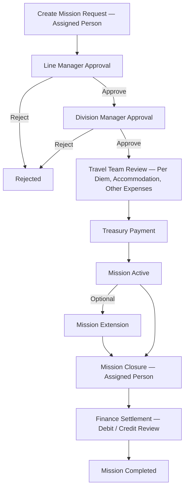
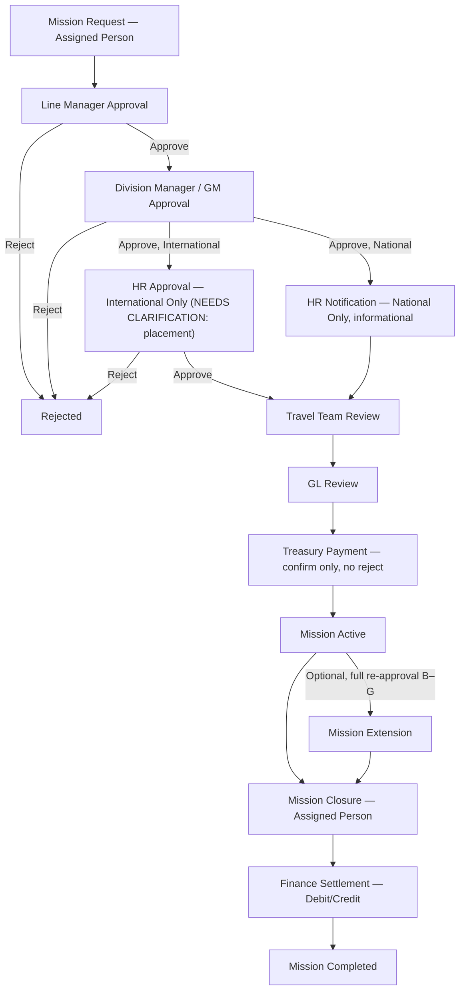

# Process Flow — MTN Sudan Travel Mission Management System

## Purpose
Documents AS-PROPOSED, validated TO-BE, exception, and approval flows, per [02_Standards/UI_UX.md](../../../02_Standards/UI_UX.md) and the BRD Process Flow section ([../02_Requirements/BRD.md](../02_Requirements/BRD.md) §19).

## Scope
Business process only. Implementation (SharePoint list/workflow configuration) is out of scope for this document — see [00_Governance](../00_Governance/README.md) for delivery-level blockers if needed for cross-reference.

## Intended Usage
Reference alongside [Screen_Inventory.md](Screen_Inventory.md) and [Assets/Diagrams](Assets/Diagrams/) for the original exported diagram images.

---

## AS-PROPOSED Flow (pre-validation, initial discovery)
Source: `MTN_Travel_Process_Flow.docx`, `Process_Validation_Document_.docx`. Original exported diagram retained at [Assets/Diagrams/Process_Flow_AS_PROPOSED.png](Assets/Diagrams/Process_Flow_AS_PROPOSED.png) and [Assets/Diagrams/Process_Flow_AS_PROPOSED_Abdullah.png](Assets/Diagrams/Process_Flow_AS_PROPOSED_Abdullah.png).



**Note:** this AS-PROPOSED flow routes Travel Review directly to Treasury Payment with no GL Review step. This was corrected in the validated MoM (see below).

## TO-BE Flow (validated, per MoM Session 1 + Second Session updates)
Source: [../00_Governance/MOM_Log.md](../00_Governance/MOM_Log.md) Entries 1–2; `APPROVED_SOURCE_OF_TRUTH_MTN_Travel_v3_docx.docx` Section 4.1.



## Approval Flow (detail)
| Stage | Actor | Applies To | Action | On Approve | On Reject |
|---|---|---|---|---|---|
| 1 | Assigned Person | All | Submit Mission Request | → Line Manager Approval | — |
| 2 | Line Manager | All | Approve/Reject | → Division Manager Approval | → Rejected |
| 3 | Division Manager/GM | All | Approve/Reject | → HR step (per mission type) | → Rejected |
| 3A | HR Team | International only | Approve/Reject | → Travel Team Review | → Rejected |
| 3B | System → HR (email) | National only | Notification only, no action | → Travel Team Review (unconditional) | N/A |
| 4 | Travel Team | All | Review/Modify/Reject/Submit to GL | → GL Review | → Rejected (per EP-05 backlog: "Reject Request" listed as a Travel Review action) |
| 5 | GL Team | All | Review/Modify/Reject/Submit to Treasury | → Treasury Payment | → Rejected |
| 6 | Treasury | All | Confirm Payment only | → Mission Active | N/A — Treasury does not reject (BR-05) |

## Exception Flow
| Exception | Trigger | Documented Handling | Source |
|---|---|---|---|
| Rejection at LM, DM, HR, Travel, or GL stage | Reviewer rejects | Status → Rejected; Assigned Person notified by email | MoM §9; source-of-truth v3 workflow status machine |
| Mission Extension with earlier end date than current | Invalid data entry | **Derived Observation, not explicitly documented** — UAT scenario UAT-EP08-EXT-001 in the source-of-truth v3 document specifies this as a negative test expectation ("Enter New End Date earlier than current end date → validation error. System must reject."), but no BRD-level statement of this rule exists independently of the UAT scenario | `APPROVED_SOURCE_OF_TRUTH_MTN_Travel_v3_docx.docx` Section 8 |
| Mission Cancellation (pre-departure) | Assigned Person requests cancellation | **MISSING INFORMATION** — rules, eligible statuses, and advance-recovery handling undefined | Second-session transcript §52:24; RAID R-08 |
| Long-term (monthly) mission reaching month-end | Mission completes one month | Must be closed; a new mission is created for the next month — no automatic extension | `Travel_System_Requirements.docx` Business Controls (BR-06) |

## BPMN Structure (textual — for Figma/BPMN tool import)
```
Pool: MTN Sudan Travel Mission Management
  Lane: Assigned Person
    Task: Create Mission Request
    Task: Close Mission
    Task: Request Extension (optional)
  Lane: Line Manager
    Task: Approve/Reject Mission Request
  Lane: Division Manager / GM
    Task: Approve/Reject Mission Request
  Lane: HR Team [NEEDS CLARIFICATION — exact lane position]
    Task: Approve/Reject (International only)
    Task: Receive Notification (National only — non-actionable)
  Lane: Travel Team
    Task: Review / Enter Costs / Modify / Reject / Submit to GL
  Lane: GL Team
    Task: Review / Modify / Reject / Submit to Treasury
  Lane: Treasury Team
    Task: Confirm Payment (no reject)
  Lane: Finance
    Task: Process Settlement (Debit/Credit)
  Gateway (exclusive): Approve/Reject — at LM, DM, HR, Travel, GL lanes
  Gateway (exclusive): Mission Type — National vs International — determines HR Approval vs. HR Notification path
  End Event: Mission Completed
  End Event: Rejected
```

## Gap Analysis (Process-Level)
Consolidated from `APPROVED_SOURCE_OF_TRUTH_MTN_Travel_v3_docx.docx` Section 2:

| Gap ID | Gap Description | Impact | Resolution |
|---|---|---|---|
| GAP-01 | HR Approval Epic entirely absent from original backlog | International missions miss a workflow step | Added as EP-NEW-01 |
| GAP-02 | Employee Grade entity not in backlog or data model | Cost calculation incorrect without grade | Added as EP-NEW-02; see [Data_Model.md](Data_Model.md) |
| GAP-03 | Mission Cancellation not in backlog | No way to cancel pre-departure mission | Added to EP-09 — rules MISSING |
| GAP-04 | Destination Pricing Matrix configuration screen absent | Travel cost auto-calculation impossible | Added to EP-05 / Admin — MISSING INFO |
| GAP-05 | Long-term mission monthly re-creation rule not in backlog | EP-08 scope was incorrect | Added as BR-06 |
| GAP-06 | Per Diem calculation formula not defined | System cannot calculate without formula | MISSING INFO — MTN Sudan to provide; Target interim proposal pending confirmation |
| GAP-07 | Accommodation calculation formula not defined | Same as GAP-06 | Same as GAP-06 |
| GAP-08 | HR Reporting requirements not defined | EP-11 scope incomplete | MISSING INFO — pending HR session |
| GAP-09 | Extension Approval sub-workflow not in original EP-08 | EP-08 stories incomplete | Addressed in updated backlog |
| GAP-10 | No Assigned Person vs. Employee field distinction in Create Mission (original design) | Missing Employee Name field | Added — see BRD §8 Decision D-02 |
| GAP-11 | No recalculation of Per Diem/Accommodation on extension (original design) | Incorrect cost totals after extension | Added — FR-12 |
| GAP-12 | No "Extended By" audit field (original design) | Extension not auditable | Added — FR-12 |

## Conflict Analysis (Process-Level)
| ID | Conflict | Source A | Source B | Resolution |
|---|---|---|---|---|
| CF-01 | UX prototype shows "Submit to Finance GL" button on Travel Review | `MTN_Travel_System_UX_Design.html` | MoM Confirmed Workflow (Travel → GL → Treasury) | RESOLVED: button reads "Submit to GL Review" |
| CF-02 | UX prototype shows "Finance GL records amounts; HR logs absence" as a step | `MTN_Travel_System_UX_Design.html` | MoM Confirmed Workflow — no such step | RESOLVED: step removed |
| CF-03 | Backlog lists "Finance Access" as a role, but MoM §5 roles list does not include Finance | `MTN_Travel_Product_Backlog_TFS.docx` | MoM §5 | OPEN — CLARIFICATION REQUIRED (BQ-07) |
| CF-04 | UX prototype shows an "Archived" status after rejection | `MTN_Travel_System_UX_Design.html` | MoM — Rejected status only | RESOLVED: "Archived" removed |
| CF-05 | Original backlog EP-08 Extension had no approval steps | `MTN_Travel_Product_Backlog_TFS.docx` | MoM §10 ("same approval cycle") | RESOLVED: full approval cycle added |
| CF-MIG-01 | Two AS-PROPOSED process-flow diagrams disagree on Travel Team Review cost items: `MTN_Travel_Process_Flow.docx` lists Per Diem, Accommodation, Visa Cost, Taxi Cost, Other Expenses; `Process_Validation_Document_.docx` (same diagram, different document) lists only Per Diem and Accommodation | `MTN_Travel_Process_Flow.docx` | `Process_Validation_Document_.docx` | OPEN — CLARIFICATION REQUIRED (CQ-N3). No later validated document (MoM, backlog, or source-of-truth v3) mentions Visa Cost or Taxi Cost, so they are NOT currently carried into the FRD, but this has not been explicitly confirmed with MTN Sudan as an intentional exclusion. |

**Note on "CF-NEW-01":** prior project context refers to a formula conflict labeled `CF-NEW-01` on Accommodation calculation, associated with a "BRD v2.0" document. No file matching that description (a distinct BRD v2.0, separate from `APPROVED_SOURCE_OF_TRUTH_MTN_Travel_v3_docx.docx`) was found among the uploaded artifacts for this migration, so its specific content could not be verified or reproduced here. This is flagged as **MISSING INFORMATION** rather than reconstructed from memory. If that document exists, it should be supplied and merged into this Design folder and the BRD.

## Future Expansion
Will be updated once MTN Sudan confirms HR workflow placement (BQ-01) and cancellation rules (BQ-06).
